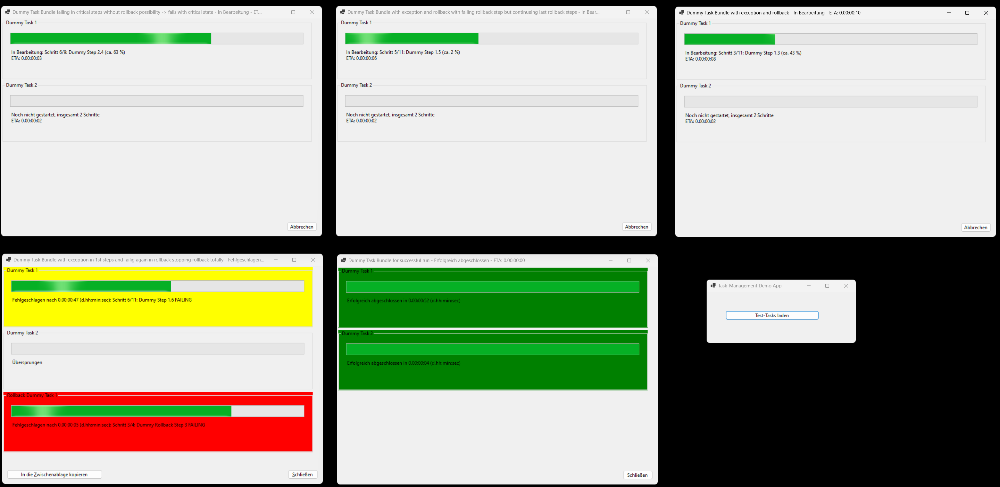
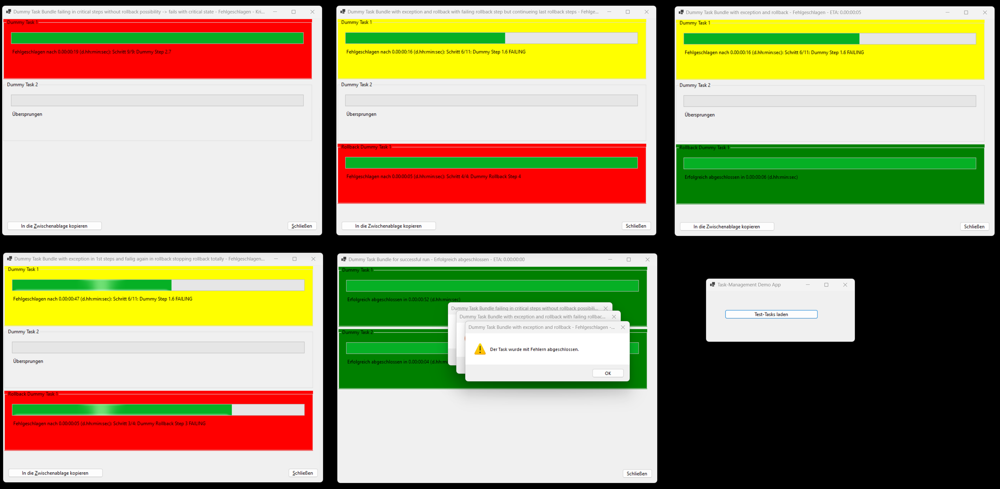

# CompuMaster.TaskManagement

[](https://github.com/CompuMasterGmbH/CompuMaster.TaskManagement/releases)
[](https://www.nuget.org/packages/CompuMaster.TaskManagement/)

## Purpose

Run (long-running) Tasks and optionally visualize them
* and control what happens on failure or Task cancellation by user
  * before the point of no-turn-back (e.g. roll-back-actions)
  * after the point of no-turn-back (e.g. some fix-actions)
* display estimated remaining duration of tasks to complete
* allow cancellation 
* show a nice Windows-Forms UI window of the Tasks and control start/stop

## Model

### TaskBundles, TaskItems, TaskSteps

* There are TaskBundles which can be started independently in parallel, e.g. cooking coffee or cooking tea
* Each TaskBundle contains 1 or more TaskItems, e.g. fill up all containers, prepare machine, run the machine, cleanup
* Each TaskItem contains 1 or more TaskSteps, e.g. fill up water, fill up milk
* A Task step is an atomic step like running a command on a database

### Successful or failing task execution

* Task steps might complete successfully or they might run into exceptions and fail
  * ProgressingTaskFailFastStep: A task step which will fail fast (throw exception) if the step fails, e.g. if the water container is missing
  * ProgressingTaskStep: A task step with configurable fail action
    * Either log the exception, mark this step as failed (will lead to continue with next step in ProgressingTaskItem)
    * or log the exception, mark this step as failed, throw the exception (will lead to fail immediately, further task steps in list won't execute any more)
* Task items
  * contain 3 different kinds of lists for steps 
    * FirstStepsWhichCanBeRolledBack
    * SecondStepsWithoutRollbackOption
    * RollbackSteps
* Task bundles 
  * might run 
    * successfull, 
    * with warnings (e.g. a step failed, but rollback was successful) 
    * or fail (e.g. step failed and rollback failed, too)
  * can be started
  * can be cancelled by user

## Samples

### Creating a task bundle with Rollback feature

#### C#

```C#
public static ProgressingTaskBundle DummyTaskBundleFailingWithRollbackFailingWithThrownException()
{
    var result = new ProgressingTaskBundle("Dummy Task Bundle with exception in 1st steps and failing again in rollback stopping rollback totally");

    var task1 = result.CreateAndAddNewTask("Dummy Task 1");
    task1.FirstStepsWhichCanBeRolledBack.Add(new ProgressingTaskFailFastStep("Dummy Step 1.1", () => System.Threading.Thread.Sleep(1000), TimeSpan.FromSeconds(1)));
    task1.FirstStepsWhichCanBeRolledBack.Add(new ProgressingTaskFailFastStep("Dummy Step 1.2", () => System.Threading.Thread.Sleep(1000), TimeSpan.FromSeconds(1)));
    task1.FirstStepsWhichCanBeRolledBack.Add(new ProgressingTaskFailFastStep("Dummy Step 1.3", () => System.Threading.Thread.Sleep(1000), TimeSpan.FromSeconds(1)));
    task1.FirstStepsWhichCanBeRolledBack.Add(new ProgressingTaskFailFastStep("Dummy Step 1.4", () => System.Threading.Thread.Sleep(1000), TimeSpan.FromSeconds(1)));
    task1.FirstStepsWhichCanBeRolledBack.Add(new ProgressingTaskFailFastStep("Dummy Step 1.5", () => System.Threading.Thread.Sleep(1000), TimeSpan.FromSeconds(1)));
    task1.FirstStepsWhichCanBeRolledBack.Add(new ProgressingTaskFailFastStep("Dummy Step 1.6 FAILING", () => throw new Exception("Failure-Test in Dummy"), TimeSpan.FromSeconds(1)));
    task1.FirstStepsWhichCanBeRolledBack.Add(new ProgressingTaskFailFastStep("Dummy Step 1.7", () => System.Threading.Thread.Sleep(1000), TimeSpan.FromSeconds(1)));

    task1.SecondStepsWithoutRollbackOption.Add(new ProgressingTaskStep("Dummy Step 2.1", () => System.Threading.Thread.Sleep(1000), TimeSpan.FromSeconds(1), ProgressingTaskStep.ProgressingTaskStepFailAction.LogExceptionAndContinue));
    task1.SecondStepsWithoutRollbackOption.Add(new ProgressingTaskStep("Dummy Step 2.2", () => System.Threading.Thread.Sleep(1000), TimeSpan.FromSeconds(1), ProgressingTaskStep.ProgressingTaskStepFailAction.LogExceptionAndContinue));
    task1.SecondStepsWithoutRollbackOption.Add(new ProgressingTaskStep("Dummy Step 2.3", () => System.Threading.Thread.Sleep(1000), TimeSpan.FromSeconds(1), ProgressingTaskStep.ProgressingTaskStepFailAction.LogExceptionAndContinue));
    task1.SecondStepsWithoutRollbackOption.Add(new ProgressingTaskStep("Dummy Step 2.4", () => System.Threading.Thread.Sleep(1000), TimeSpan.FromSeconds(1), ProgressingTaskStep.ProgressingTaskStepFailAction.LogExceptionAndContinue));

    task1.RollbackSteps.Add(new ProgressingTaskStep("Dummy Rollback Step 1", () => System.Threading.Thread.Sleep(1000), TimeSpan.FromSeconds(1), ProgressingTaskStep.ProgressingTaskStepFailAction.LogExceptionAndContinue));
    task1.RollbackSteps.Add(new ProgressingTaskStep("Dummy Rollback Step 2", () => System.Threading.Thread.Sleep(1000), TimeSpan.FromSeconds(1), ProgressingTaskStep.ProgressingTaskStepFailAction.LogExceptionAndContinue));
    task1.RollbackSteps.Add(new ProgressingTaskStep("Dummy Rollback Step 3", () => System.Threading.Thread.Sleep(1000), TimeSpan.FromSeconds(1), ProgressingTaskStep.ProgressingTaskStepFailAction.ThrowException));
    task1.RollbackSteps.Add(new ProgressingTaskStep("Dummy Rollback Step 4", () => System.Threading.Thread.Sleep(1000), TimeSpan.FromSeconds(1), ProgressingTaskStep.ProgressingTaskStepFailAction.ThrowException));

    var task2 = result.CreateAndAddNewTask("Dummy Task 2");
    task2.SecondStepsWithoutRollbackOption.Add(new ProgressingTaskStep("Dummy Task 2 Step 1", () => System.Threading.Thread.Sleep(1000), TimeSpan.FromSeconds(1), ProgressingTaskStep.ProgressingTaskStepFailAction.LogExceptionAndContinue));
    task2.SecondStepsWithoutRollbackOption.Add(new ProgressingTaskStep("Dummy Task 2 Step 2", () => System.Threading.Thread.Sleep(1000), TimeSpan.FromSeconds(1), ProgressingTaskStep.ProgressingTaskStepFailAction.LogExceptionAndContinue));

    return result;
}
```

#### VB.NET
 
```VB.NET
    Public Shared Function DummyTaskBundleFailingWithRollbackFailingWithThrownException() As ProgressingTaskBundle
        Dim Result As New ProgressingTaskBundle("Dummy Task Bundle with exception in 1st steps and failig again in rollback stopping rollback totally")
        Dim Task1 As ProgressingTaskItem = Result.CreateAndAddNewTask("Dummy Task 1")
        Task1.FirstStepsWhichCanBeRolledBack.Add(New ProgressingTaskFailFastStep("Dummy Step 1.1", Sub() Threading.Thread.Sleep(1000), New TimeSpan(0, 0, 1)))
        Task1.FirstStepsWhichCanBeRolledBack.Add(New ProgressingTaskFailFastStep("Dummy Step 1.2", Sub() Threading.Thread.Sleep(1000), New TimeSpan(0, 0, 1)))
        Task1.FirstStepsWhichCanBeRolledBack.Add(New ProgressingTaskFailFastStep("Dummy Step 1.3", Sub() Threading.Thread.Sleep(1000), New TimeSpan(0, 0, 1)))
        Task1.FirstStepsWhichCanBeRolledBack.Add(New ProgressingTaskFailFastStep("Dummy Step 1.4", Sub() Threading.Thread.Sleep(1000), New TimeSpan(0, 0, 1)))
        Task1.FirstStepsWhichCanBeRolledBack.Add(New ProgressingTaskFailFastStep("Dummy Step 1.5", Sub() Threading.Thread.Sleep(1000), New TimeSpan(0, 0, 1)))
        Task1.FirstStepsWhichCanBeRolledBack.Add(New ProgressingTaskFailFastStep("Dummy Step 1.6 FAILING", Sub() Throw New Exception("Failure-Test in Dummy"), New TimeSpan(0, 0, 1)))
        Task1.FirstStepsWhichCanBeRolledBack.Add(New ProgressingTaskFailFastStep("Dummy Step 1.7", Sub() Threading.Thread.Sleep(1000), New TimeSpan(0, 0, 1)))
        Task1.SecondStepsWithoutRollbackOption.Add(New ProgressingTaskStep("Dummy Step 2.1", Sub() Threading.Thread.Sleep(1000), New TimeSpan(0, 0, 1), ProgressingTaskStep.ProgressingTaskStepFailAction.LogExceptionAndContinue))
        Task1.SecondStepsWithoutRollbackOption.Add(New ProgressingTaskStep("Dummy Step 2.2", Sub() Threading.Thread.Sleep(1000), New TimeSpan(0, 0, 1), ProgressingTaskStep.ProgressingTaskStepFailAction.LogExceptionAndContinue))
        Task1.SecondStepsWithoutRollbackOption.Add(New ProgressingTaskStep("Dummy Step 2.3", Sub() Threading.Thread.Sleep(1000), New TimeSpan(0, 0, 1), ProgressingTaskStep.ProgressingTaskStepFailAction.LogExceptionAndContinue))
        Task1.SecondStepsWithoutRollbackOption.Add(New ProgressingTaskStep("Dummy Step 2.4", Sub() Threading.Thread.Sleep(1000), New TimeSpan(0, 0, 1), ProgressingTaskStep.ProgressingTaskStepFailAction.LogExceptionAndContinue))
        Task1.RollbackSteps.Add(New ProgressingTaskStep("Dummy Rollback Step 1", Sub() Threading.Thread.Sleep(1000), New TimeSpan(0, 0, 1), ProgressingTaskStep.ProgressingTaskStepFailAction.LogExceptionAndContinue))
        Task1.RollbackSteps.Add(New ProgressingTaskStep("Dummy Rollback Step 2", Sub() Threading.Thread.Sleep(1000), New TimeSpan(0, 0, 1), ProgressingTaskStep.ProgressingTaskStepFailAction.LogExceptionAndContinue))
        Task1.RollbackSteps.Add(New ProgressingTaskStep("Dummy Rollback Step 3", Sub() Threading.Thread.Sleep(1000), New TimeSpan(0, 0, 1), ProgressingTaskStep.ProgressingTaskStepFailAction.ThrowException))
        Task1.RollbackSteps.Add(New ProgressingTaskStep("Dummy Rollback Step 4", Sub() Threading.Thread.Sleep(1000), New TimeSpan(0, 0, 1), ProgressingTaskStep.ProgressingTaskStepFailAction.ThrowException))
        Dim Task2 As ProgressingTaskItem = Result.CreateAndAddNewTask("Dummy Task 2")
        Task2.SecondStepsWithoutRollbackOption.Add(New ProgressingTaskStep("Dummy Task 2 Step 1", Sub() Threading.Thread.Sleep(1000), New TimeSpan(0, 0, 1), ProgressingTaskStep.ProgressingTaskStepFailAction.LogExceptionAndContinue))
        Task2.SecondStepsWithoutRollbackOption.Add(New ProgressingTaskStep("Dummy Task 2 Step 2", Sub() Threading.Thread.Sleep(1000), New TimeSpan(0, 0, 1), ProgressingTaskStep.ProgressingTaskStepFailAction.LogExceptionAndContinue))
        Return Result
    End Function
```

### Dummy Task Bundles

Create form for multiple task bundles

#### C#

```C#
private void TestVonLongRunTaskBundlesButton_Click(object sender, EventArgs e)
{
    MultiTaskProgessForm f;
    f = new MultiTaskProgessForm(DummyTaskBundles.DummyTaskBundleFailingWithRollback);
    f.Show();
    f = new MultiTaskProgessForm(DummyTaskBundles.DummyTaskBundleFailingWithRollbackFailingWithThrownException);
    f.Show();
    f = new MultiTaskProgessForm(DummyTaskBundles.DummyTaskBundleFailingWithRollbackFailingWithLoggedException);
    f.Show();
    f = new MultiTaskProgessForm(DummyTaskBundles.DummyTaskBundleFailingInCriticalStepsWithoutRollbackPossibility);
    f.Show();
    f = new MultiTaskProgessForm(DummyTaskBundles.DummyTaskBundleSuccessful);
    f.Show();
}
```

#### VB.NET

```VB.NET
Private Sub TestVonLongRunTaskBundlesButton_Click(sender As Object, e As EventArgs) Handles TestVonLongRunTaskBundlesButton.Click
               Dim f As MultiTaskProgessForm
               f = New MultiTaskProgessForm(DummyTaskBundles.DummyTaskBundleFailingWithRollback)
               f.Show()
               f = New MultiTaskProgessForm(DummyTaskBundles.DummyTaskBundleFailingWithRollbackFailingWithThrownException)
               f.Show()
               f = New MultiTaskProgessForm(DummyTaskBundles.DummyTaskBundleFailingWithRollbackFailingWithLoggedException)
               f.Show()
               f = New MultiTaskProgessForm(DummyTaskBundles.DummyTaskBundleFailingInCriticalStepsWithoutRollbackPossibility)
               f.Show()
               f = New MultiTaskProgessForm(DummyTaskBundles.DummyTaskBundleSuccessful)
               f.Show()
End Sub
```


### Example UI with Windows Forms

#### Running Tasks



#### Tasks completed



